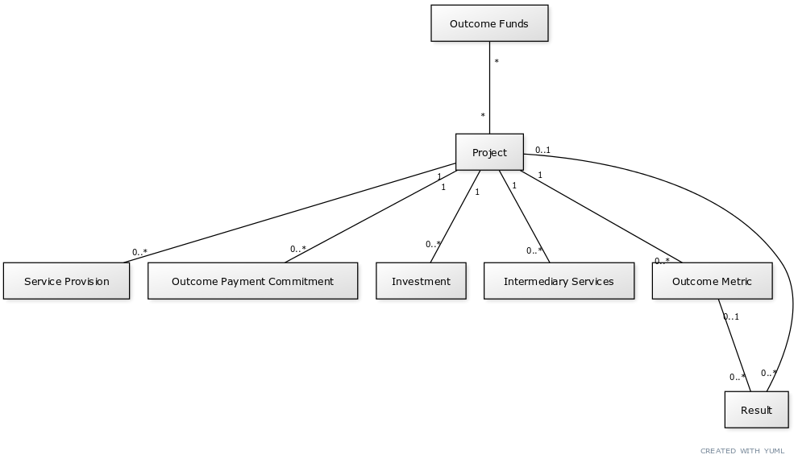
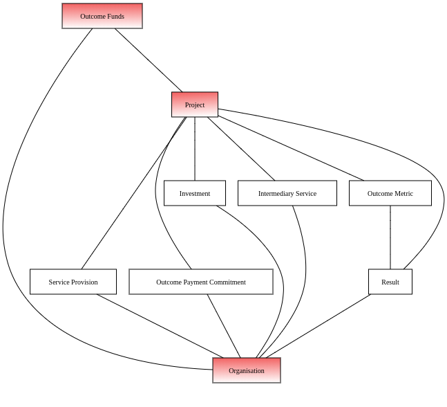
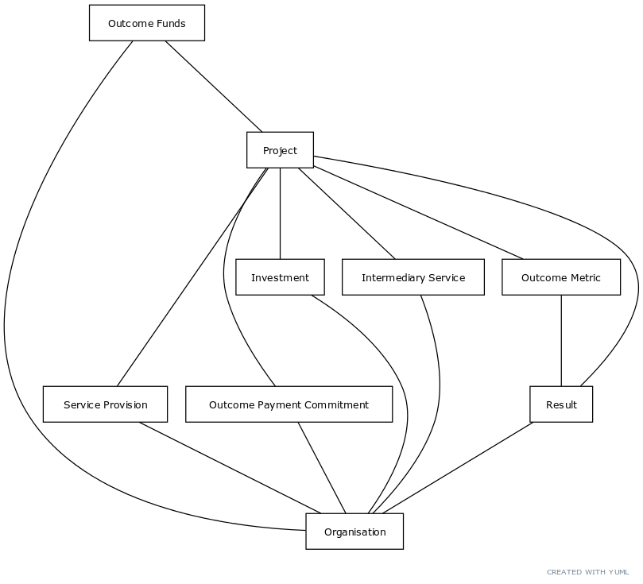

Data Model
==========

The data model described here is intended as the first steps towards an open data standard. As more data is published using the model, we hope that the ideas here will provoke interest and criticism and be informed by wider conversations in the sector.

Overview of the data model
--------------------------

A high-level diagram representing the core data model is presented below.

A project is the building block of the INDIGO data specification, representing a single impact bond, social investment or other partnership.

A project can be further broken down into any number of components. These components may represent activities and agreements (like investments, delivery, technical assistance, outcome-based payment agreements and outcome metrics) or measurements of, or associated with, activities and their effect (like outcome metric results or financial performance).

Results and evaluations can be associated either with individual outcome metrics or the project as a whole.

Upstream sources of payment funding can be described by linking any number of outcome funds to a project.

Project-level and disaggregated data
------------------------------------

A cross-sector collaboration is modelled in the INDIGO Data Specification as a project. A project can represent a social impact bond, outcomes based contract or similar partnership.

Project-level attributes provide an overview of a given project, and are designed to provide a useful and unambiguous overview and a backstop in the absence of more granular disclosures.

A project can also be described in terms of its disaggregated components. These individual indicators provide more detail than is available at a project level and are a closer match for the composite nature of how social impact bonds are arranged, delivered and measured.

Project-level data should always be a complete and up-to-date representation of knowledge about a project. Data at a project-level may or may not include and account for the addition of and updates to disaggregated data.

Disaggregated data should be a complete and up-to-date representation of the relevant individual component of a project. Where a corresponding project-level attribute exists, completeness of disaggregated disclosures should not be assumed.

.. admonition:: Example

   A social impact bond declares total investment committed of USD1,000,000 at the project level. Two disaggregated investment disclosures are available for the project, of USD250,000 and USD500,000. The sum of the disaggregated investments, USD750,000, does not match the total investment commitment for the overall project. There may be several reasons for this discrepancy, including confidentiality, and the project-level figure should be preferred.

Shared vs project-level data objects
------------------------------------

To reduce duplication and error and allow for easier analysis, the INDIGO data standard shares some data across all datasets. The shared objects are: projects, organisations, outcome funds and investment funds.

Shared objects are distinguished by identifiers with an 'INDIGO' prefix. See  `INDIGO identifiers <identifiers.html>`_.

Each shared object should only be described once, and any new data or corrections added as updates rather than creating a new, duplicate object with a new INDIGO identifier.

Core and extended datasets
--------------------------

The data dictionary lists the datasets which fields are expected to appear in. The specification has no formal mechanism to  restrict the collection of data. But, in general, there is a 'core' set of data fields that all datasets are encouraged to collect; other datasets may collect extra fields for a specific purpose, either for learning purposes or as a result of a particular data-sharing agreement. The core data fields may expand over time, and become more formalised, as the specification matures.

Organisation roles and classifications
--------------------------------------

Datasets collected using the INDIGO specification provide two ways to understand organisations.

The first is by using external identifiers, like company or charity numbers, that can be linked to canonical data sources like a company or charity register. These identifiers will allow analysis by organisational type, jurisdiction, sector and other basic demographics. Data sourced *from* these identifiers should not be replicated in the dataset but may be used in analysis.

The second is by allowing a dynamic picture of organisational activity to emerge from the data itself rather than preassigning classifications. This is done by associating individual components (like an investment) of a project with one or more organisations, as in the diagram below.

An organisation may appear multiple times in a single project, in different roles, and also recur across projects. The organisation can be traced across projects using `INDIGO identifiers`_. Some components also allow an organisation's role to be further broken down via a codelist.

.. admonition:: Example

   A diversified NGO makes an investment of USD250,000 in a project and is also involved in an aspect of service delivery. The same organisation would appear twice in the data that describes the project: first associated with an `Investment` and then associated with a `Service Provision`. Both of these would describe the organisation in the `Organisational Role Category` of "Nonprofit/NGO".

Data collected in this way allows for analysis of the sector as a whole, as well as changes in organisational behaviour over time.

Relationships between organisations
^^^^^^^^^^^^^^^^^^^^^^^^^^^^^^^^^^^

The data model allows for lightweight modelling of control relationships between organisations, of the form "Organisation A is controlled by Organisation B".

This is useful in cases where, for example, investments are held in subsidiary companies and there is a common parent company that can be used for analysis.

A *controlling* organisation is described like a normal organisation.

A relationship between two organisations is declared by the *controlled* organisation, using the INDIGO ID of the controlling organisation in the `Controlled By` tab.

In general, a relationship between two organisations is assumed to be a relationship between an organisation and its ultimate parent organisation.
